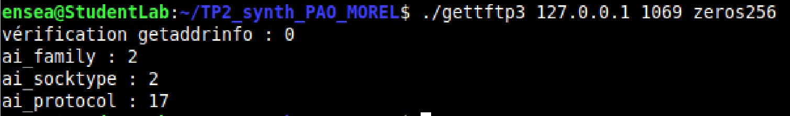
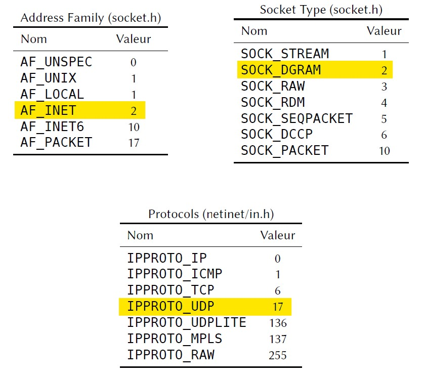
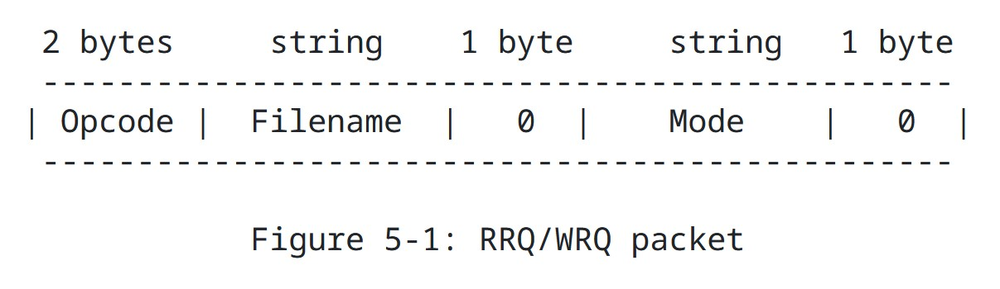

# TP2_synthese_MOREL_PAO

The objectives of this lab is to develop a TFTP client using RFC specifications and Wireshark captures.

Indications : n in the "gettftpn.c" files means that it's the n-th question.
(example : gettftp2.c is the code for the 2nd question)

## Question 1
First, in order to obtain the server's address, we re-used the code previously used in the TDm3, with the getaddrinfo() function.

## Question 2
To test the function, we put in the terminal the following command : ./gettftp3 127.0.0.1 1069 zeros256
127.0.0.1 is the address of the server, 1069 is the port's number and zeros256 the file's name.

The function getaddrinfo returns a 0 when there is no error. ai_family, ai_protocol and ai_socket return the values they are rightly associated to.

## Question 3
We reserve a connection socket to the server.

## Question 4
A RRQ packet is as followed : 

We have 0 | 1 | z | e | r | o | s | 2 | 5 | 6 | 0 | o | c | t | e | t | 0
if we are dealing with the "zeros256" file for example. The opcode is 0x1 because it is associated to a read request.

In Wireshark, in the lo (Loopback) interface, we put the following filter :
"udp && ip.dist==127.0.0.1 && udp.port == 1069"

